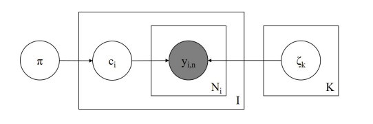
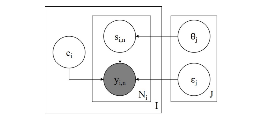

# Problem Statement
We are working with a collection of text annotations provided by multiple annotators. The goal is to infer the true (latent) labels for each text based on the available annotations.

# Related work & Idea
The most comprehensive survey to date of Bayesian annotation models is [Paun et al. (2018)](https://aclanthology.org/Q18-1040.pdf), who evaluate six generative approaches differing in how they pool annotator and item parameters: the Multinomial model, the Dawid \& Skene model, the MACE model, the Hierarchical Dawid \& Skene model, the Item Difficulty model, and the Logistic Random Effects model. **Our work builds directly on these six formulations — adapting the publicly available [implementations](https://num.pyro.ai/en/latest/examples/annotation.html) to incorporate LLM-derived logits as informative priors for true label inference**.

# Our approach
- We train Bayesian annotation models that account for the reliability of each annotator. These models estimate the probability distribution over true labels by considering the observed annotations and modeling each annotator's behavior. 

- We incorporate predictions from an LLM as a prior for the true label distribution. These LLM-generated probabilities help guide the model when the observed annotations are sparse or noisy, serving as an informed prior belief about the likely true label.

- Since the true labels are unknown, we evaluate the model by how well it predicts the annotators' behavior.

Note that not every annotator labels every text, which makes the implementation more technically challenging. Our code assumes binary annotation, but it can be easily extended to multi-class settings.

# Dataset 
**Dataset** The data on which we tested our models is drawn from the Gab Hate Corpus (GHC), a collection of 27 665 posts harvested from the Gab.ai platform. Each post was independently annotated by at least three trained coders using a coding typology that integrates legal, computational, psychological, and sociological definitions of hate speech. This richly annotated, multi-annotator dataset provides the evidence-based foundation for evaluating our Bayesian annotation models in a real-world online hate-speech setting.

**LLM** We use the logits produced by \textbf{Qwen-2.5-32B} with a six-shot prompt tailored for hate-speech detection; the prompt states the task objective, provides step-by-step instructions, and highlights the textual cues to consider when deciding whether a passage contains hate speech.

The dataset and LLM logits are not provided in this repository.

# Metrics 
We evaluate our approach based on the Jensen-Shannon and Kullback–Leibler divergences when comparing the model's predicted distribution of annotator labels versus the empirical distribution. To compare classification based on majority vote, the binary F1 score from sci-kit learn was used.

# Realization 
We are comparing several baselines and probabilistic models.

## Baselines 
- Logistic regression: predicts the distribution of annotator votes (also incorporating the raw logit scores as features)
- Treating arg-max logits from an LLM as a deterministic prediction for each annotator's label.

## Models
### Dawid-Skene
The Dawid–Skene model assumes that each annotator has a confusion matrix that characterizes their likelihood of assigning each possible label given the true label. By iteratively estimating these confusion matrices and the true label distribution, the model infers the most probable true labels across the dataset. We extend this approach by using LLM logits as a prior.

   
  <em>Reference: <a href="https://aclanthology.org/Q18-1040.pdf">Comparing Bayesian Models of Annotation</a></em>

### Multinomial
The Multinomial (or “single-confusion-matrix”) model is a simplified Dawid–Skene variant that assumes every annotator shares one global confusion matrix. This captures average crowd behaviour without modelling individual workers, yielding a fast and stable baseline when annotator-specific data are sparse. As with DS, we seed the latent true-label distribution with the LLM logits, treating them as an informative Bayesian prior.

   
  <em>Reference: <a href="https://aclanthology.org/Q18-1040.pdf">Comparing Bayesian Models of Annotation</a></em>

### MACE
MACE (Multi-Annotator Competence Estimation) augments the global-matrix idea with a sparsity prior that drives each worker’s confusion probabilities toward either perfect accuracy or random guessing. This automatic “pruning” makes MACE robust to spammers and low-effort annotators, often matching DS performance even when individual confusion matrices are poorly estimated. We initialise worker competences with the aggregate signal provided by the LLM logits.

   
  <em>Reference: <a href="https://aclanthology.org/Q18-1040.pdf">Comparing Bayesian Models of Annotation</a></em>

### Hierarchical DS
Hierarchical Dawid–Skene introduces group-level priors over annotator confusion matrices—e.g., by platform, language background, or experience level—so that sparse workers “borrow strength” from their peers. This mitigates over-fitting in thin-annotation regimes while retaining per-annotator nuance. We again warm-start the latent truths with Qwen-2.5-32B logits, which the hierarchy treats as an external knowledge source.

   
  <em>Reference: <a href="https://aclanthology.org/Q18-1040.pdf">Comparing Bayesian Models of Annotation</a></em>

### Item-Difficulty
The Item-Difficulty extension factors the probability of error into worker ability $\times$ item difficulty. Harder examples thus induce correlated mistakes across annotators, a phenomenon the simpler models cannot capture. Fitting per-item difficulty parameters helps separate genuinely ambiguous inputs from low-quality annotations, leading to cleaner gold labels. LLM logits act as a soft guide for both the true label and an initial notion of difficulty (low-confidence logits often signal hard items).

   
  <em>Reference: <a href="https://aclanthology.org/Q18-1040.pdf">Comparing Bayesian Models of Annotation</a></em>

### Logistic Random-Effects
The Logistic Random-Effects model treats the crowd-agreement task as a mixed-effects logistic regression: fixed effects capture systematic predictors (e.g., LLM logit score, item length), while random effects assign Gaussian-distributed offsets to both annotators and items. This flexible structure accommodates residual heterogeneity—idiosyncratic workers or outlier sentences—without a combinatorial explosion of parameters. Posterior inference yields calibrated probabilities for the true label and interpretable variance components (how much noise comes from workers vs. items).

   
  <em>Reference: <a href="https://aclanthology.org/Q18-1040.pdf">Comparing Bayesian Models of Annotation</a></em>

# Model Comparison

| Model                     | Avg. JS Div. | Avg. KL Div. | F1-score |
|---------------------------|-------------:|-------------:|---------:|
| Logistic Reg.             | 0.3486 | 1.4264 | 0.3889 |
| Argmax Baseline           | 0.3822 | 1.9643 | 0.3568 |
| Multinomial               | 0.1653 | 0.5337 | 0.1464 |
| Dawid–Skene (DS)          | 0.1649 | 0.5322 | 0.1244 |
| MACE                      | 0.1653 | 0.5337 | 0.1463 |
| Hierarchical DS           | 0.1652 | 0.5334 | 0.1536 |
| Item Difficulty           | 0.1649 | 0.5323 | 0.1371 |
| Logistic Random Effects   | —      | —      | —      |

Although probabilistic models achieve low divergence from the true label distribution, their F1-scores remain relatively low. This suggests that while these models can accurately approximate the overall uncertainty or distribution over labels, they are less effective at producing accurate point predictions. In contrast, discriminative models perform better in terms of F1-score, but worse in capturing the full label distribution. This highlights a trade-off between distributional accuracy and prediction sharpness.

# Future work
- Incorporate LLM hidden states as semantic priors in our Bayesian annotation models (to compare annotators' labels also in terms of their semantic alignment with the input)
- Train a model to identify a subset of reliable annotators and evaluate its accuracy. Additionally, use this subset to assess the performance of Bayesian models.
