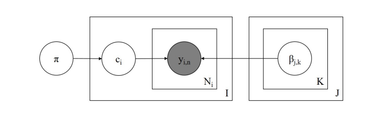

# Problem Statement
We are working with a collection of text annotations provided by multiple annotators. The goal is to infer the true (latent) labels for each text based on the available annotations.

# Our approach
- We train Bayesian annotation models that account for the reliability of each annotator. These models estimate the probability distribution over true labels by considering the observed annotations and modeling each annotator's behavior. 

- We incorporate predictions from an LLM as a prior for the true label distribution. These LLM-generated probabilities help guide the model when the observed annotations are sparse or noisy, serving as an informed prior belief about the likely true label.

- Since the true labels are unknown, we evaluate the model by how well it predicts the annotators' behavior.

Note that not every annotator labels every text, which makes the implementation more technically challenging.

# Dataset 

# Metrics 

# Realization 
We are comparing the following models:

## Baselines 
### Logistic regression 
Smth about the approach?

### Using LLM predictions as a true answer 

## Models
### Dawid-Skene
The Dawid–Skene model assumes that each annotator has a confusion matrix that characterizes their likelihood of assigning each possible label given the true label. By iteratively estimating these confusion matrices and the true label distribution, the model infers the most probable true labels across the dataset. We extend this approach by using LLM logits as a prior.

   
  <em>Reference: <a href="https://aclanthology.org/Q18-1040.pdf">Comparing Bayesian Models of Annotation</a></em>

### Rest...

### Model Comparison

| Model                        | Avg. JS Divergence | Avg. KL Divergence | Binary F1 (Majority Vote) |
|-----------------------------|--------------------|--------------------|----------------------------|
| Scikit-learn Logistic Reg.  | 0.3486             | 1.4264             | 0.3889                     |
| Dawid–Skene                 | None               | None               | None                       |

scikit-learn logistic regression numbers:
Average Jensen-Shannon divergence across items= 0.34862660788676153
Average KL divergence across items= 1.4264024275823348
Binary F1 score with majority vote = 0.3888888888888889

# Acknowledgements
We strongly rely on the Bayesian models implementation provided in the [Pyro annotation example](https://num.pyro.ai/en/latest/examples/annotation.html) and the article ["Comparing Bayesian Models of Annotation"](https://aclanthology.org/Q18-1040.pdf).
